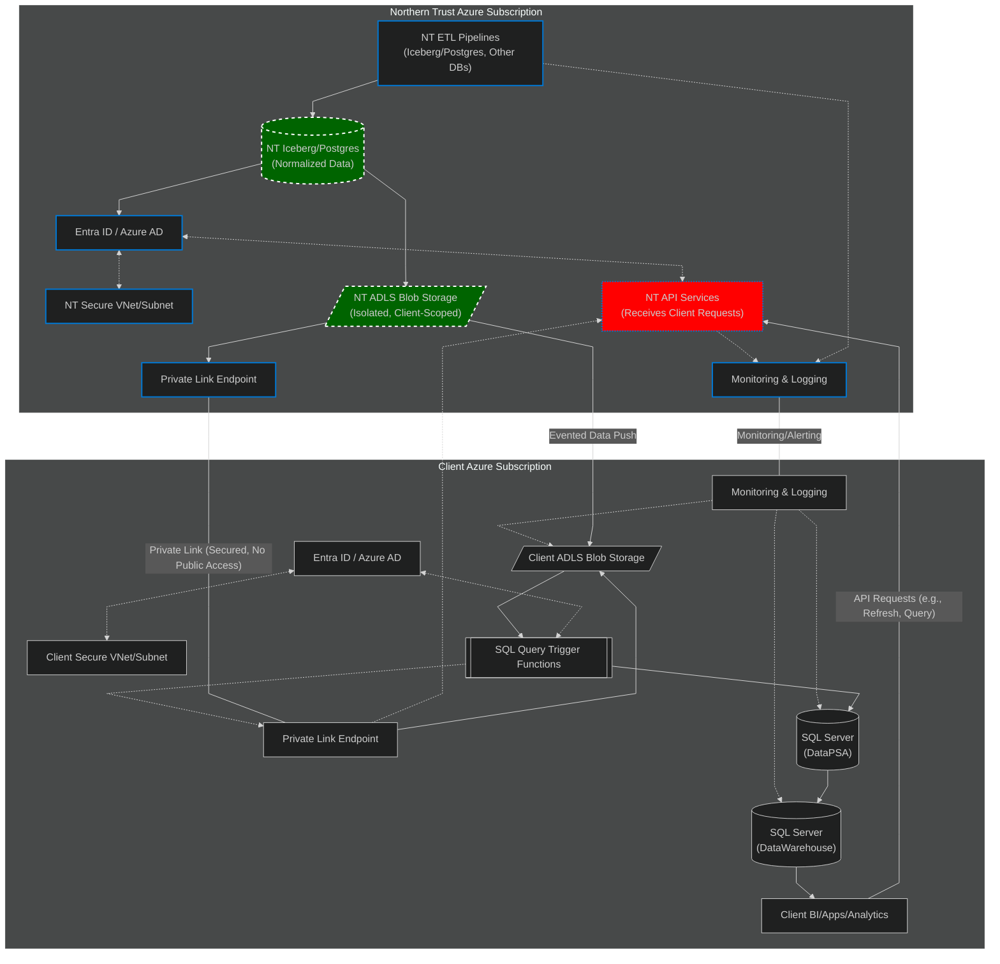
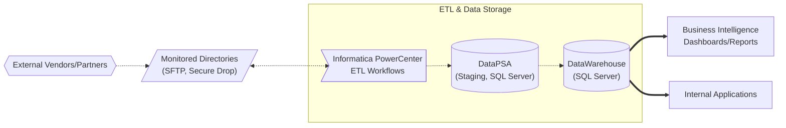

# Seamless Data Sharing Between Client and Custodian: Architecture Overview

---

## Table of Contents
<!-- TOC -->

* [Seamless Data Sharing Between Client and Custodian: Architecture Overview](#seamless-data-sharing-between-client-and-custodian-architecture-overview)
  * [Table of Contents](#table-of-contents)
  * [Introduction](#introduction)
  * [Guiding Principles](#guiding-principles)
  * [Target-State Architecture](#target-state-architecture)
    * [Northern Trust Azure Subscription](#northern-trust-azure-subscription)
    * [Client Azure Subscription](#client-azure-subscription)
    * [Process Flows](#process-flows)
    * [Security Model](#security-model)
  * [Core Azure Technologies Involved](#core-azure-technologies-involved)
  * [Required Client Outcomes](#required-client-outcomes)
  * [Process Flow Diagram](#process-flow-diagram)
  * [The Client's Current World](#the-clients-current-world)
    * [Generic Items](#generic-items)
    * [Key Objectives](#key-objectives)
    * [Future Target State](#future-target-state)
    * [Data Lifecycle](#data-lifecycle)
      * [1. External Data Sourcing](#1-external-data-sourcing)
      * [2. Ingestion and Processing Tooling](#2-ingestion-and-processing-tooling)
      * [3. Staging and Validation](#3-staging-and-validation)
      * [4. Promotion to DataWarehouse](#4-promotion-to-datawarehouse)
      * [5. Consumption and Reporting](#5-consumption-and-reporting)
    * [Summary Table: Data Lifecycle Stages](#summary-table-data-lifecycle-stages)
    * [Key Principles](#key-principles)
    * [Current Data Flow Diagram](#current-data-flow-diagram)
  * [Conclusion](#conclusion)
  * [Areas Benefiting Microsoft Professional Services Guidance](#areas-benefiting-microsoft-professional-services-guidance)
  * [Next Steps](#next-steps)

<!-- /TOC -->

---

## Introduction

As the Global Head of Data Arch and Engineering, I am committed to delivering a more modern, robust, and secure data sharing ecosystem between Northern Trust and our clients. This document outlines high-level the vision for a seamless, cloud-native architecture that eliminates legacy friction and enables secure, auditable, and scalable data delivery. Our approach is to process, catalog, and store all required datasets—whether daily, ongoing, or intraday—within Northern Trust’s Azure subscription using Iceberg/Parquet and other modern data platforms, and then deliver them securely to the client’s Azure environment using Azure-native technologies.

---

## Guiding Principles

- **Seamless Transition:** No disruption to current data flows during migration.
- **Clean Migration:** Preserve existing processes and structures for a stable cutover.
- **Modernization:** Expand and enhance the architecture post-migration for scalability, analytics, and operational excellence.

---

## Target-State Architecture

We are building a secure, automated data sharing platform that leverages Azure Data Lake Storage (ADLS), Private Link, Azure Active Directory (Entra ID), and isolated VNets/subnets. This ensures all data movement is private, compliant, and auditable. Event-driven workflows, robust monitoring, and API-driven refresh capabilities provide clients with timely, reliable, and transparent access to their data, while minimizing operational friction.

### Northern Trust Azure Subscription

- Data is normalized and ETL’d from multiple NT databases (Iceberg/Postgres/others) into NT ADLS Blob Storage.
- NT API services are available for client-initiated requests (e.g., refresh, query).
- All resources are protected by secure VNets/subnets and managed identities (Entra/Azure AD).
- Data is shared only via Private Link—no public network exposure.
- Monitoring and logging are in place for all critical services.

### Client Azure Subscription

- Client’s ADLS Blob Storage receives evented data via Private Link.
- Monitoring detects new data and triggers SQL query functions to move data into DataPSA (SQL Server) and then DataWarehouse.
- Client BI/Analytics apps consume data from the DataWarehouse.
- All resources are protected by secure VNets/subnets and managed identities (Entra/Azure AD).
- Monitoring and logging are in place for all critical services.

### Process Flows

1. NT normalizes and prepares custody/fund accounting data, storing it in NT ADLS.
2. Data is shared with the client’s ADLS via Private Link (event-driven).
3. Client-side monitoring triggers ingestion into SQL Server DataPSA and DataWarehouse.
4. Client BI/Apps consume the data.
5. Client can send API requests to NT for refreshes or queries.
6. Monitoring and alerting are bi-directional for operational transparency.

### Security Model

- All data movement is secured by Azure Private Link, Entra/Azure AD, and isolated VNets/subnets.
- No public endpoints are exposed at any point in the process.

---

## Core Azure Technologies Involved

- **Azure Data Lake Storage (ADLS):** Secure, scalable storage for structured/unstructured data; enables event-driven delivery and sharing.
- **Azure Private Link:** Private, secure data transfers—never traverses the public internet.
- **Azure Virtual Network & Subnets:** Network isolation and security boundaries.
- **Azure Active Directory (Entra ID):** Authentication, authorization, and RBAC.
- **Azure SQL Server:** Hosts DataPSA (staging) and DataWarehouse (analytics/operations).
- **Azure Event Grid:** Event-driven automation for file delivery and ingestion.
- **Azure Logic Apps/Functions/Data Factory:** Orchestrates data refreshes, ingestion, and transformation pipelines.
- **Azure Monitor & Log Analytics:** Comprehensive monitoring, alerting, and auditing.
- **Apache Iceberg / PostgreSQL:** Data normalization, cataloging, and storage (NT side).
- **Parquet Format:** Efficient, columnar storage for analytics workloads.
- **Informatica PowerCenter:** Client’s current ETL tool for ingestion and transformation.
- **Managed Identities & RBAC:** Secure, automated identity and access management.

---

## Required Client Outcomes

- **Timely and Reliable Data Delivery:** Predictable, event-driven delivery of files and datasets, with automated notifications and seamless ingestion.
- **Self-Service Data Refresh and Orchestration:** Ability to initiate data refreshes or reprocessing on demand, using secure queries and event-driven orchestration.
- **Scalability and Modernization:** Leverage Azure services for scalability, elasticity, and integration with evolving cloud infrastructure.
- **Data Consistency and Synchronization:** Minimize duplication and ensure alignment between NT and client environments, with robust monitoring and transparency.
- **Security, Compliance, and Transparency:** All data exchanges leverage Azure security best practices, with comprehensive auditing and monitoring.

---

## Process Flow Diagram

---

## The Client's Current World

### Generic Items

**Terms**
- **DataPSA:** Staging Lake(s), SQL Server
- **DataWarehouse:** Analytical and Operational Database, SQL Server
- **Custodian Bank:** External provider of financial data and reporting

**Technology Stack**

_Current:_
- Informatica Power Query (PowerCenter) for ETL
- SQL Server (on-premises)
- On-premises hosting

_Modernizing to:_
- Azure (cloud migration)
- SQL Server (lift-and-shift to Azure for DataPSA and DataWarehouse)
- Potential adoption of Databricks for advanced analytics

---

### Key Objectives

- **Seamless Transition:** Avoid disruption to current data flows during migration.
- **Clean Migration:** Maintain existing processes and structures for a stable cutover.
- **Modernization:** Expand and enhance architecture post-migration for scalability and analytics.

---

### Future Target State

The client is actively modernizing, including a transition to a new custodian bank. This impacts all legacy data systems, as new data feeds and integration points must be established.

---

### Data Lifecycle

The data lifecycle is structured as a supply chain for information:

- Data is sourced from external files and systems, representing raw materials arriving at a receiving dock.
- **Informatica** functions as the logistics and processing team, collecting, organizing, and transforming these raw materials into usable components.
- The processed data is delivered to **DataPSA**, which serves as the inspection and staging warehouse. Here, each item is validated, reconciled, and prepared for final delivery, ensuring only high-quality data proceeds.
- Once validated, data is moved into **DataWarehouse**, the storefront where finished products are made available for business users, analysts, and decision-makers. This ensures that every data asset is accurate, traceable, and ready for consumption.

#### 1. External Data Sourcing

- **Sources:** Data is received from external vendors, partners, and systems (e.g., Northern Trust, Moody’s, PureView, NDR, Risk Vendors, fund-managers) as flat files (CSV, TXT) or database extracts. Additional sources include DB2 and manual triggers via user interfaces.
- **Delivery:** Files are delivered to secure, monitored directories (e.g., `$PMSourceFileDir\{Custodian}Pull\`) using SFTP, secure file drop, or automated upstream processes.
- **Triggering:** The arrival of a new file in a watched directory triggers scheduled ETL workflows.

#### 2. Ingestion and Processing Tooling

- **Primary Tool:**  
  **Informatica PowerCenter** is the core ETL platform.
    - **Workflows:** Orchestrate the end-to-end process, including file detection, logging, and error handling.
    - **Sessions:** Each session is configured to process a specific file or data type, using mappings to align source columns with internal schemas.
    - **Source Qualifiers & Filters:** Define how data is read and filtered (e.g., only rows with valid dates, or specific transaction codes).
    - **SQL Logic:** Custom SQL (pre-SQL, main SQL, post-SQL) is used for data transformation, enrichment, deduplication, and business rule enforcement.

#### 3. Staging and Validation

- **Staging Area:**  
  Data is first loaded into **DataPSA** (Platform Staging Area) tables in SQL Server.
    - **Validation:** Referential integrity checks, record count reconciliation, and error logging are performed.
    - **Reconciliation:** Data is compared against source counts and business rules to ensure quality.
    - **Audit:** All steps are logged for traceability and compliance.

#### 4. Promotion to DataWarehouse

- **Validated Data:**  
  Once data passes validation, it is promoted to the **DataWarehouse** tables.
    - **Integration:** Data from multiple sources is integrated, cleansed, and made consistent.
    - **Business Logic:** Stored procedures may further aggregate or transform data for reporting needs.

#### 5. Consumption and Reporting

- **Business Use:**  
  DataWarehouse tables serve as the authoritative source for:
    - Business intelligence dashboards
    - Regulatory and operational reporting
    - Analytics and decision support
    - Vital accounting reports
    - Internal applications

---

### Summary Table: Data Lifecycle Stages

| Stage                    | Description                                                                                   | Key Tools/Systems         |
|--------------------------|-----------------------------------------------------------------------------------------------|---------------------------|
| External Data Sourcing   | Data received from vendors/partners as files or extracts, delivered to monitored directories  | SFTP, Secure Drop, DB2    |
| Ingestion & Processing   | ETL jobs triggered by file arrival, transforming and validating data                          | Informatica PowerCenter   |
| Staging & Validation     | Data loaded into staging tables, validated, reconciled, and audited                           | DataPSA (SQL Server)      |
| Promotion to DataWarehouse | Validated data integrated and promoted for business use                                      | DataWarehouse (SQL Server)|
| Consumption & Reporting  | Data used for BI, reporting, analytics, and internal applications                             | BI Tools, Internal Apps   |

---

### Key Principles

- **Data Quality:** Multiple validation and reconciliation steps ensure only high-quality data is promoted.
- **Traceability:** All processing steps are logged for audit and compliance.
- **Readiness:** Data is made available for business use only after passing all quality gates.

---

### Current Data Flow Diagram

---

## Conclusion

This document has outlined the current and target-state architecture for secure, automated data sharing between Northern Trust and the client, leveraging a comprehensive suite of Azure cloud services. The solution is designed to deliver all required datasets—on daily, ongoing, and intraday schedules—by processing, cataloging, and storing them within Northern Trust’s Azure subscription using Iceberg/Parquet and other modern data platforms, and then securely delivering them to the client’s Azure environment via Azure-native technologies such as Private Link, ADLS, and robust monitoring.

The workflows described ensure data quality, traceability, and operational transparency, while the security model leverages Azure Private Link, Entra/Azure AD, and isolated VNets/subnets to guarantee compliance and privacy. The architecture supports event-driven automation, self-service refreshes, and seamless integration with the client’s analytics and reporting platforms.

---

## Areas Benefiting Microsoft Professional Services Guidance

The following areas would benefit from deep insight and best-practice guidance from Microsoft Azure experts:

- **Azure Data Lake Storage (ADLS) Design:** Guidance on optimal structuring, partitioning, cataloging (with Iceberg/Parquet), and lifecycle management for high-volume, multi-tenant data.
- **Private Link and Network Security:** Best practices for configuring Private Link, VNets, subnets, and network isolation to ensure zero public exposure and secure cross-subscription data flows.
- **Identity and Access Management:** Implementation of Entra/Azure AD, managed identities, and RBAC for both automated pipelines and interactive users, including cross-tenant scenarios.
- **Event-Driven Orchestration:** Patterns for using Azure Event Grid, Logic Apps, Functions, and Data Factory to automate data movement, trigger downstream processing, and enable self-service refreshes.
- **SQL Server Integration:** Strategies for efficient, secure ingestion from ADLS to SQL Server (DataPSA and DataWarehouse), including automation, monitoring, and error handling.
- **Monitoring, Logging, and Auditing:** Recommendations for end-to-end observability using Azure Monitor, Log Analytics, and alerting to ensure operational transparency and compliance.
- **Data Consistency and Synchronization:** Approaches for minimizing duplication, ensuring data consistency, and providing lineage and reconciliation between NT and client environments.
- **Scalability and Cost Optimization:** Guidance on scaling storage, compute, and orchestration components, and optimizing for performance and cost.
- **Modernization and Future-Proofing:** Recommendations for integrating with advanced analytics (e.g., Azure Synapse, Databricks), supporting evolving business needs, and preparing for future cloud-native enhancements.

---

## Next Steps

Review these architectural components and workflows, provide targeted recommendations, and help design and implement a secure, scalable, and efficient data sharing ecosystem that meets both current and future requirements for Northern Trust and the client.
